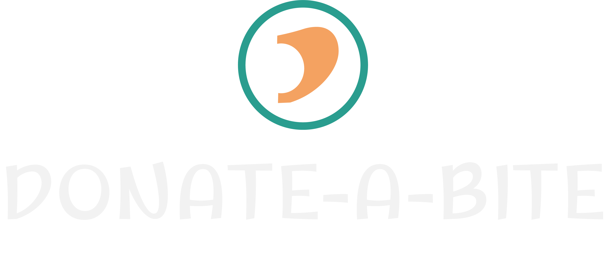

  

# 🍽️ Donate-A-Bite

📚 **Welcome to Donate-A-Bite** — A MERN stack used an online Local Food Waste Reduction Platform  where restaurants donate surplus food, charities request and pick up donations, and users browse listings or request to become charities.

🚀 **Donate-A-Bite has 4 roles**, each with specific responsibilities:

---

## 👥 Roles & Responsibilities

### 1. **User (General Visitor)**

- Browse and save donation listings
- Submit reviews for donations
- Request to become a Charity by paying a one-time fee via Stripe (pending Admin approval)

### 2. **Charity**

- Request donations from restaurants
- Confirm pickup of donations
- Track received donations
- Manage transaction history

### 3. **Restaurant**

- Add surplus food donations
- View and manage requested donations
- Track donation history

### 4. **Admin**

- Manage donations, users, and role requests
- Feature donations for better visibility
- Approve charity requests
- Oversee overall platform operations

---

🌟 **Features**

🌸 **Role-Based Dashboards**: Dynamic dashboards tailored for each user role.

🌾 **All Donations Page**: Browse all verified donations approved by admins.

🧭 **Donation Details Page**:

- Save to Favorites (User/Charity)
- Request Donation (Charity only)
- Confirm Pickup (Charity only)
- Add Review & View Reviews

❓ **User Dashboard**: Profile, Request Charity Role, Favorites, Reviews, Transaction History

👥 **Restaurant Dashboard**: Restaurant Profile, Add Donations, My Donations, Requested Donations

✍️ **Charity Dashboard**: Profile, My Requests, Pickups, Received Donations, Transaction History

📂 **Admin Dashboard**: Manage Donations, Users, Role Requests, Feature Donations

💬 **Notifications & Alerts**: SweetAlert2 integration for smooth alerts.

🔐 **Secure Authentication**:

- Email/password login & registration
- Social login via Google
- JWT-based secure routes

💳 **Stripe Integration**: Secure payments for Charity role requests with transaction tracking.

🌗 **Dark/Light Mode**: Toggle themes for optimal viewing experience.

📱 **Responsive Design**: Works beautifully on all devices with Tailwind CSS.

---

⚙️ **Technology Stack**

### 🔷 Frontend

- ⚛️ [React](https://reactjs.org/)
- ⚡ [Vite](https://vitejs.dev/)
- 🎨 [Tailwind CSS](https://tailwindcss.com/)
- 🎞️ [Framer Motion](https://www.framer.com/motion/)
- 🖼️ [Swiper](https://swiperjs.com/)
- 🔔 [SweetAlert2](https://sweetalert2.github.io/)
- 🧠 [React Hook Form](https://react-hook-form.com/)
- 🧪 [TanStack Query](https://tanstack.com/query/latest)
- 🖋️ [Google Fonts](https://fonts.google.com/)
- 🖼️ [ImageBB](https://imgbb.com/)

### 🛠️ Backend

- 🟢 [Node.js](https://nodejs.org/) & [Express.js](https://expressjs.com/)
- 🍃 [MongoDB](https://www.mongodb.com/) & [Mongoose](https://mongoosejs.com/)
- 💳 [Stripe](https://stripe.com/docs)
- 🔐 [Firebase Auth](https://firebase.google.com/docs/auth)
- 🛡️ JWT Token for secure authentication

---

📦 **NPM Packages Used**

- 🎨 Tailwind CSS
- ⚡ Vite
- ⚛️ React
- 🚦 React Router
- 🎞️ Framer Motion
- 🖼️ Swiper
- 🔔 SweetAlert2
- 🧠 React Hook Form
- 🧪 TanStack Query
- 🔐 Firebase Authentication
- 🌐 Google Fonts & ImageBB
- 🟢 Node.js & Express.js
- 🍃 MongoDB & Mongoose
- 💳 Stripe
- 🛡️ JWT

---

